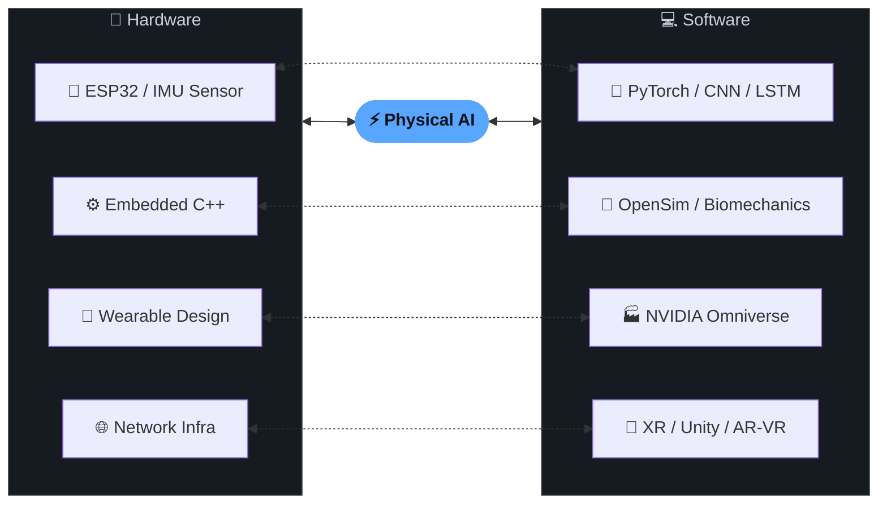

<div align="center">

<!-- Typing animation -->
<a href="https://github.com/yoshizawariku">
  
</a>

<br/>

<!-- Social badges -->
[](https://github.com/yoshizawariku)
[](https://www.linkedin.com/in/riku-yoshizawa-927664334)
[](https://github.com/yoshizawariku)
[](https://github.com/yoshizawariku)
[](https://github.com/yoshizawariku)

</div>

---

## 👨‍💻 About Me

```python
class RikuYoshizawa:
    university  = "University of Tsukuba, Graduate School"
    program     = "Intelligent & Mechanical Interaction Systems (M1)"
    lab         = "Cybernics Laboratory"
    research    = ["Wearable IoT", "Knee Joint Load Estimation", "Physical AI", "Sim-to-Real"]
    languages   = ["Python", "C#", "C++", "Java"]
    interests   = ["IoT × AI fusion", "Robotics", "Digital Twin", "XR"]
    status      = "🎯 Open to new opportunities"
    publication = "SII/SICE 2026 @ Cancun, Mexico 🌊"
```

> **"見えないインフラが価値を支える"**  
> — ハードウェアからAIまで、フルスタックで社会課題を解決する

---

## 🔬 Research Highlights

<table>
<tr>
<td width="50%">

### 🦿 Knee Joint Load Estimation
**IMU Sensor × 1D-CNN / LSTM**

- 9軸IMUセンサ（加速度・角速度・地磁気）から膝関節の**3次元接触力をリアルタイム推定**
- 従来研究の1次元 → **3次元方向**へ拡張
- OpenSim による筋骨格解析との照合で高精度検証
- ラベリングツール自作で作業効率 **×6 改善**
- 🏥 筑波大学病院との共同研究・実証試験予定

</td>
<td width="50%">

### 🤖 Sim-to-Real Platform (NVIDIA Omniverse)
**Isaac Sim × Isaac Lab**

- 人とロボットの協働のためのシミュレーション環境構築
- ウェアラブルデバイス身体データのシミュレーション転送サーバー構築
- ロボットアームの強化学習（RL）検証
- 製造・物流向けデジタルツインへの応用

</td>
</tr>
</table>

---

## 📄 Publications

| Year | Venue                              | Paper                                                                                                                                               |
| ---- | ---------------------------------- | --------------------------------------------------------------------------------------------------------------------------------------------------- |
| 2026 | **SII/SICE 2026** @ Cancun, Mexico | [Three-Dimensional Knee Joint Contact Force Estimation Using Wearable IMU Sensors and Deep Learning](https://ieeexplore.ieee.org/document/11404679) |

---

## 💻 Tech Stack

### Languages


### AI / ML / Data


### Embedded / IoT


### XR / Simulation


### Infrastructure / DevOps


---

## Featured Projects

<table>
<tr>
<td width="50%">

### 🏋️ [SquatScope](https://github.com/yoshizawariku/SquatScope)

IMU + EMG センサ（M5StickC Plus2）から BLE で 1000 Hz データを受信・リアルタイム可視化する Python アプリ


[](https://github.com/yoshizawariku/SquatScope/stargazers)

</td>
<td width="50%">

### 🎨 [Marp4VSCode-CSS-CustomPrompt](https://github.com/yoshizawariku/Marp4VSCode-CSS-CustomPrompt)

Marp for VS Code 用カスタム CSS テーマ + AI 支援スライド作成ガイド。GitHub Pages CDN で即利用可能


[](https://github.com/yoshizawariku/Marp4VSCode-CSS-CustomPrompt/stargazers)

</td>
</tr>
</table>

---

## 🏆 Key Achievements

| 🎯 Achievement        | 📝 Detail                                       |
| -------------------- | ---------------------------------------------- |
| **国際学会発表**     | SII/SICE 2026 @ Cancun, Mexico                 |
| **6× 効率化**        | 時系列データラベリングツール自作（1h → 10min） |
| **産学連携**         | 筑波大学病院との共同研究・実証試験             |
| **ラボインフラ刷新** | GitLab サーバー導入・ネットワーク設計          |
| **Local LLM Server** | OpenCrow ベースの研究効率化サーバー構築中      |
| **サークル代表 2年** | 留学生 9名を招致・日英 Bot 開発・参加率改善    |

---

## 🌐 Domain Expertise



---

<div align="center">

### 💬 Let's Connect!

*Research intern / Full-time opportunities welcome*

[](https://github.com/yoshizawariku)
[](https://www.linkedin.com/in/riku-yoshizawa-927664334)

<br/>


</div>
